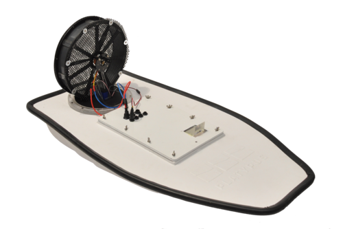
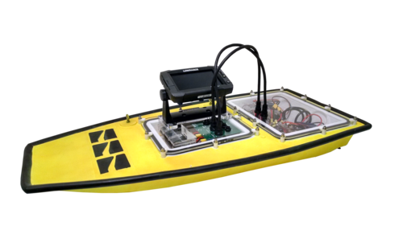

==========================
Welcome to LSA's Platypus Boat guides
==========================

About the Boats
-----------------

Autonomous Systems Laboratory - PUCRS
--------------------------------------

This documment written by `LSA <https://lsa-pucrs.github.io/>`_ describes the procedure to configure and use Platypus boats.
LSA has three boats: two airboats and a prop boat. They are used for water monitoring and disaster mitigation applications.

Summary
--------------------------------------

.. toctree::
   :maxdepth: 3
    
   source/getting_started/index
   source/ros/index
   source/gams-madara/index
   source/rpi/index
   source/odroid/index
   source/jetson/index
   source/boat/index
   source/field-testing/index
   source/contributors/index
   source/applications/index
   source/eboard/index

Disclaimer
----------

The purpose of this document is for the use of LSA group only, but we open it in case it can be usefull for someone else.
Thus, we dont fill obliged to give any technical support, although we might help in some special situations.
In addition, we are not associated with `Platypus LLC <http://senseplatypus.com/>`_.

Everything you find here is without absolutly no waranty and I'm not responsible for any inconveniences or issues that might occurs. 

Feedback
--------

Don't hesitate to ask about some additional info or next guides and also if you find some mistakes, please let me know.
This can be done by submitting an issue or a push request on github.

