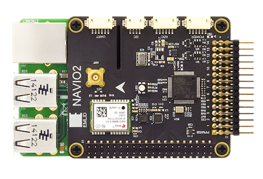

=================
NAVIO2 Autopilot
=================

`Navio2 <https://emlid.com/navio/>`_ is an autopilot shield developed by Emlid that is used with a Raspberry Pi board. The Navio2 eliminates any need to have multiple controllers on-board as everything is packed into one (with the Raspberry Pi), thus increasing the robustness of your project and facilitating the development. With the Navio2, you can control all kinds of moving robots such as cars, boats, multirotors and planes. 

Navio2 has many built-in sensors including terrific inertial sensor MPU9250 (Gyro + Accelerometer + Compass), barometer. In addition there are GPS, ADC and many other stuff you'll need in the building process. Some of the accessories in the Navio2 board are:

- **GNSS receiver**: Tracks GPS, GLONASS, Beidou, Galileo and SBAS satellites. External antenna with MCX connector
- **Dual IMU**: Accelerometers, gyroscopes and magnetometers for orientation and motion sensing
- **RC I/O co-processor**: Accepts PPM/SBUS input and provides 14 PWM output channels for motors and servos
- **High resolution barometer**: Senses altitude with 10 cm resolution
- **Extension ports**: Exposed ADC, I2C and UART interfaces for sensors and radios
- **Triple redundant power supply**: With overvoltage protection and power module port for voltage and current sensing

.. toctree::

   Lutra Airboat Configuration <lutra>
   Raspberry Configuration <rasp>
   
