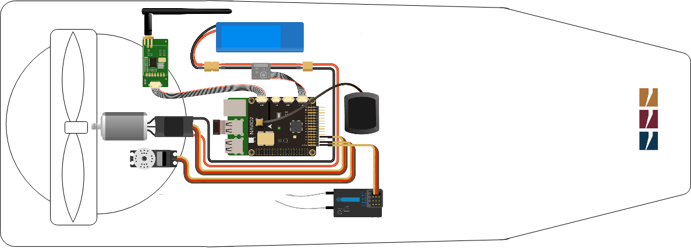

============================
Lutra Airboat Configuration 
============================

`Lutra Airboat <http://senseplatypus.com/lutra-airboat/>`_ is designed for smaller bodies of water. It boasts an extremely low profile and is deployable in as little at six inches of water. A covered, twelve inch fan provides smooth movement at five to six miles per hour. Lutra Airboat contains a fan to control the movement of the boat and a servo to control its direction. 

The autopilot configuration when using Lutra Airboat is illustred in the scheme below: 

