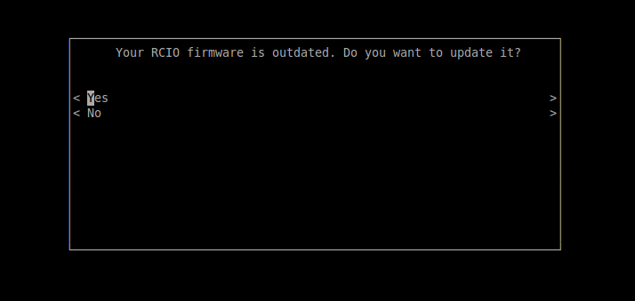
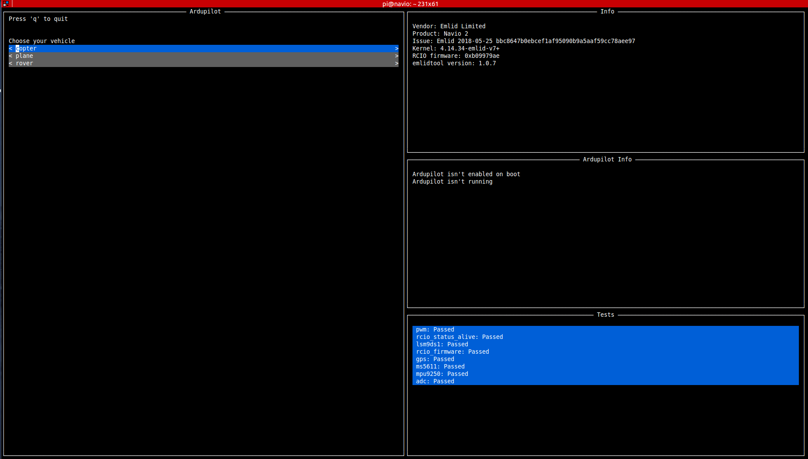
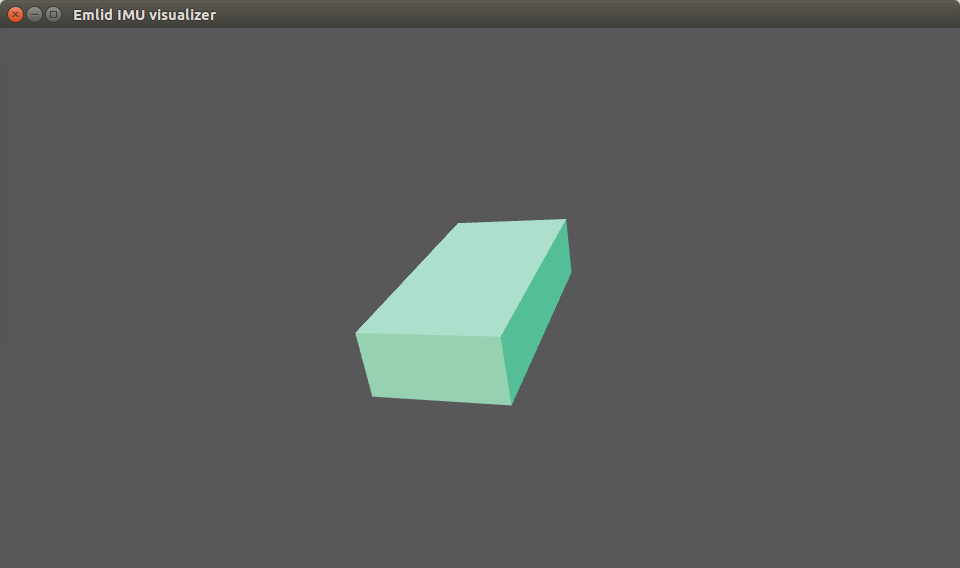

========================
Raspberry Configuration 
========================

The first step before configurating the Raspberry Pi is to attach the Navio2 on the Raspberry board. As described in `Navio2 documentation <https://docs.emlid.com/navio2/ardupilot/hardware-setup/>`_, install all spacers to the top side of Raspberry Pi and fix them with screws from the bottom, connect the extension header to the 40-pin gpio port and attach Navio2 to the extension header. Finally, fix Navio2 using screws as illustrated below:

.. image:: images/navio2_mounting.png
    :align: center
    :width: 500pt

Writing image to SD card
-------------------------

After mounting the Navio2 shield on the Raspberry, download a preconfigured version of Raspbian and write it to a SD card. You can download the latest version from `Emlid page <https://docs.emlid.com/navio2/common/ardupilot/configuring-raspberry-pi/#downloading-configured-raspbian-image>`_ and follow the steps:

- Get the latest Emlid Raspbian Image
- Download, extract and run `Etcher <https://etcher.io/>`_
- Select the Emlid Rapbian image file and the SD card drive letter
- Click "Flash!" to complete. Wait for few minutes...

Configuring Wi-Fi 
------------------

Having the Emlid Raspbian image written in the SD card, configure the network access. As the board is inside the boat, we connect the Raspberry to the Tegra-WLAN provided by Jetson board. In order to do so, edit the ``wpa_supplicant.conf`` file located on the ``/boot`` partition in SD card as:

.. code-block:: bash

   network={
      ssid="Tegra-WLAN"
      psk=edcae6b3d85a41abbc9a3a67e26bc5943ce6faf1c4146db9bdad462b40cab1af
   }

Connecting to Rasperry Pi
--------------------------
You can now insert an SD-card into RPi2. .

Now you have configured the Wi-fi access, you can test the connection by inserting the SD card into Raspberry and turning it on (make sure that everything is securely connected to Raspberry). As Raspberry will connect to the Tegra-WLAN, you can use another computer in the same network to ping to ``navio.local`` host. In case it is acessible, connect by ssh using:

.. code-block:: bash

   $ ssh pi@navio.local
   #passwd: raspberry

Connecting the Raspberry to the ethernet, you can upgrade your system by running:

.. code-block:: bash

   $ sudo apt-get update
   $ sudo apt-get dist-upgrade

It takes quite a few minutes, during the process you should confirm updates. When connected to the Raspberry, you have to select the type of vehicle (ArduPlane, ArduRover or ArduCopter) the autopilot will connect. To do so, run the command:

.. code-block:: bash

   $ sudo emlidtool ardupilot

This command will first ask for a update in RCIO firmware as illustred in the image below. 

Choose ``Yes`` and it will flash a new firmware into the Navio2. Now, reboot the system. Log again into the Raspberry and run again the command to select the vehicle. A screen equal to the image below will appear, containing the options ``copter``, ``plane`` and ``rover``. 

This command will first ask for a update in RCIO firmware as illustred in the image below. 

As Lutra Airboat contains a fan for propulsion and a servo to direction, we select the ``rover`` option with the latest version (3.3) and the frame ``ardurover``, being enable on boot.

Testing Navio2
---------------

To test Navio2 functionalities we can download the examples from its `Github page <https://github.com/emlid/Navio2>`_. To get the entire example folder on your Raspberry you should clone it from github as:

.. code-block:: bash

   $ git clone https://github.com/emlid/Navio2.git

Inside ``Navio2`` folder we can find C++ and Python examples. Let's try C++ examples by using the commands:

.. code-block:: bash

   $ cd Navio2/C++/Examples/AccelGyroMag/
   $ make

.. ERROR::
   Navio+/RCInput_Navio.h:4:20: fatal error: pigpio.h: No such file or directory

To get rid of this error, we have to install ``pigpio`` package using:

.. code-block:: bash

   $ sudo apt-get update
   $ sudo apt-get install pigpio

Now we are able to compile and run Navio2 examples. Let's run the accelerometer, gyroscope and magnetometer reader using:

.. code-block:: bash

   $ cd Navio2/C++/Examples/AccelGyroMag/
   $ make
   $ sudo ./AccelGyroMag -i MPU9250

   Selected: MPU9250
   Acc:  +0.036  +0.065 +10.100  Gyr:   +0.004   -0.170   +0.043  Mag: -17.284  -9.280 -36.888
   Acc:  -0.000  -0.093 +10.150  Gyr:   -0.004   -0.187   +0.045  Mag: -17.226  -9.280 -36.308
   Acc:  +0.122  -0.036 +10.122  Gyr:   -0.011   -0.181   +0.043  Mag: -17.342  -9.106 -36.714
   Acc:  +0.029  -0.108 +10.086  Gyr:   -0.007   -0.181   +0.048  Mag: -16.646  -8.990 -36.424
   Acc:  +0.050  -0.043 +10.035  Gyr:   -0.010   -0.177   +0.043  Mag: -17.052  -9.802 -35.786

We can test examples in Python as well, using:

.. code-block:: bash

   $ cd Navio2/Python
   $ python AccelGyroMag.py -i mpu

   Selected: MPU9250
   Connection established: True
   Acc:  +0.043  +0.215 +10.309  Gyr:   -0.024   +0.003   +0.006  Mag:  +8.436 +40.348 -69.950
   Acc:  +0.034  +0.168 +10.281  Gyr:   -0.029   +0.007   +0.007  Mag:  +7.886 +39.797 -70.128
   Acc:  -0.048  +0.254 +10.271  Gyr:   -0.029   +0.005   +0.005  Mag:  +6.786 +41.265 -70.128
   Acc:  -0.081  +0.273 +10.142  Gyr:   -0.029   +0.007   +0.006  Mag:  +7.153 +40.164 -69.418
   Acc:  -0.005  +0.192 +10.104  Gyr:   -0.026   +0.005   +0.010  Mag:  +7.336 +41.081 -69.240

Testing IMU Visualizer
-----------------------

In your local computer clone the Navio2 repository and run the ``3Dimu.py`` script with:

.. code-block:: bash

   $ git clone https://github.com/emlid/Navio2.git
   $ cd Navio2/Utilities/3DIMU/
   $ python 3Dimu.py

In Raspberry, go to ``AHRS`` and run the executable as:

.. code-block:: bash

   $ cd Navio2/C++/Examples/AHRS/
   $ ./AHRS -i MPU9250 192.168.2.185 7000

In your local computer, check the IMU visualizer window while move Raspberry around. A screen as the image below should appear.

Visualizing GPS data
---------------------

In your local computer, install `APM Planner <http://ardupilot.org/planner2/index.html>`_, which is an open-source ground station application for MAVlink based autopilots including APM. In order to install APM Planner, download its latest version from `Ardupilot site <http://firmware.ardupilot.org/Tools/APMPlanner/>`_ and install by running:

.. code-block:: bash

   $ sudo dpkg -i apm_planner_2.0.23_debian_stretch.deb
   $ sudo apt-get -f install
   $ sudo dpkg -i apm_planner_2.0.23_debian_stretch.deb
