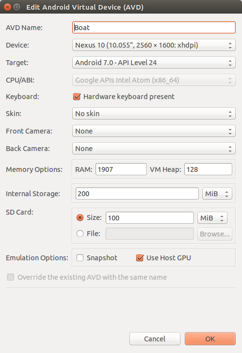
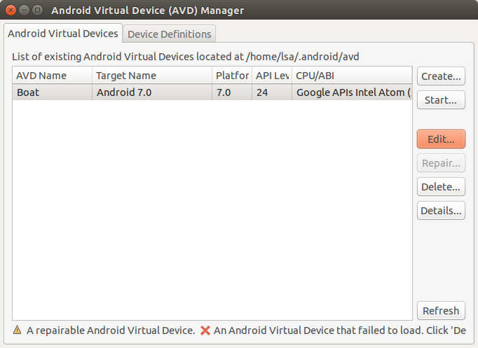
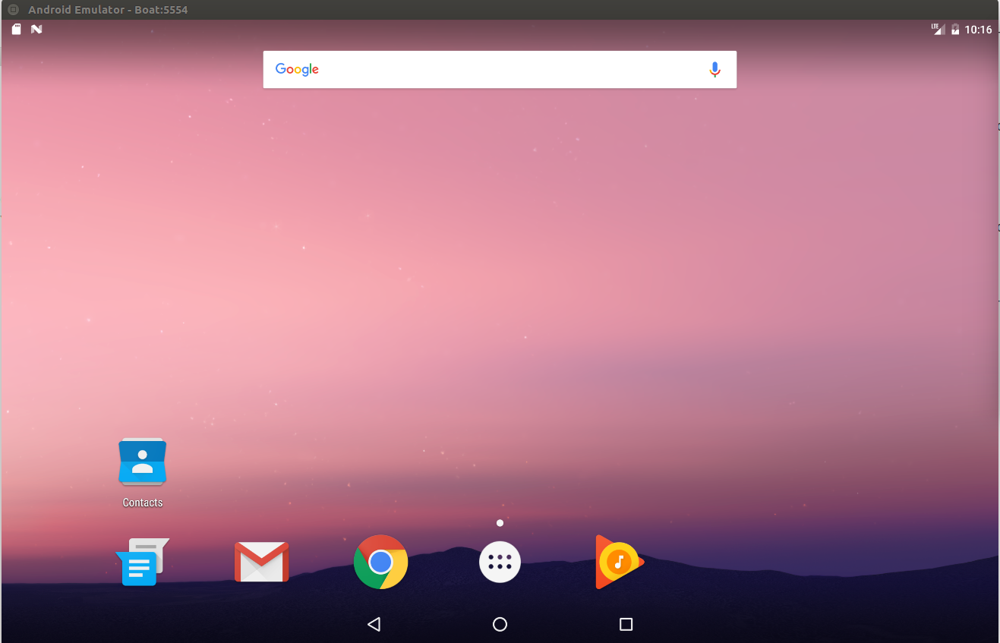
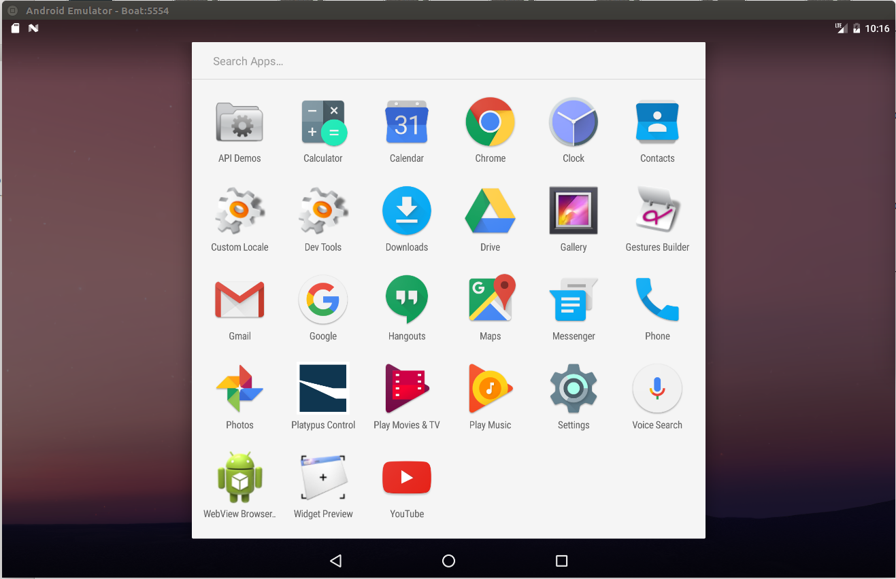
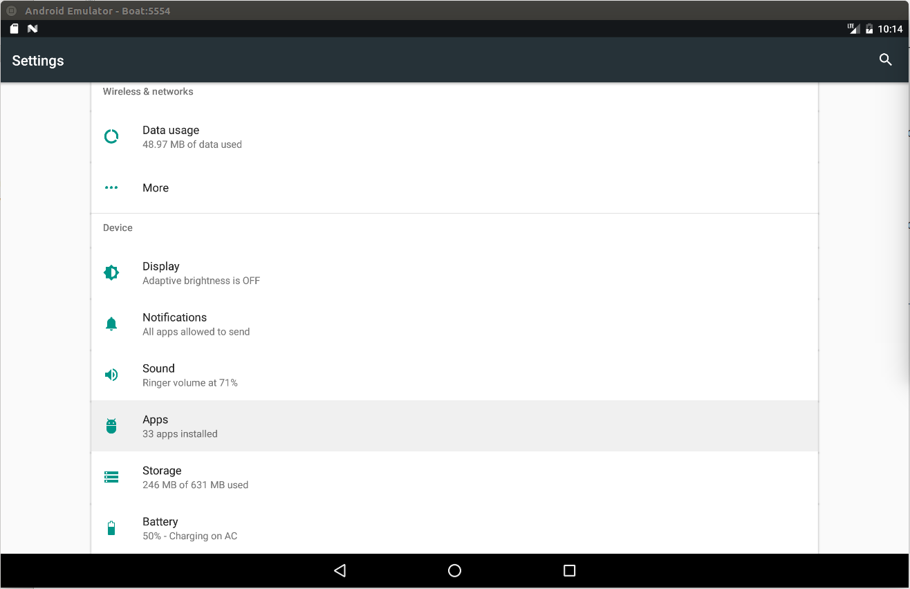
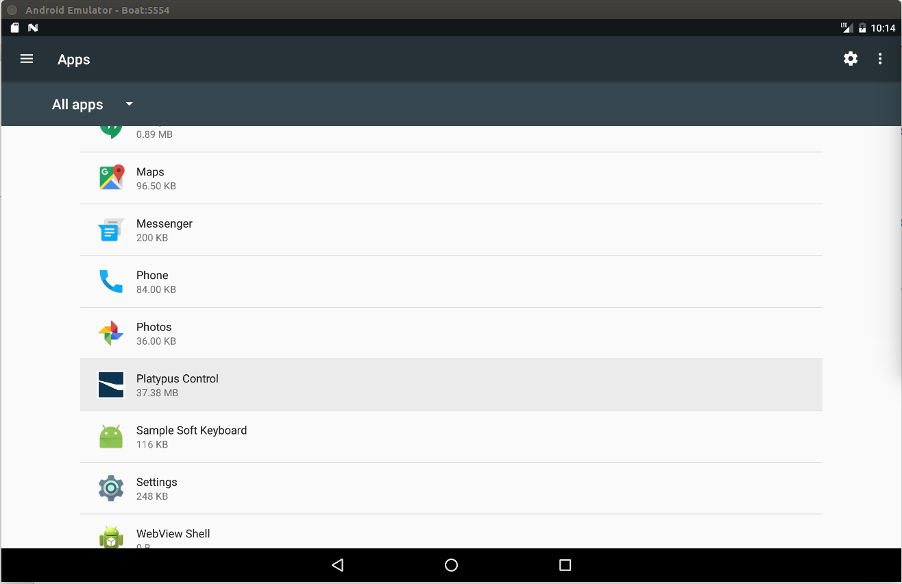
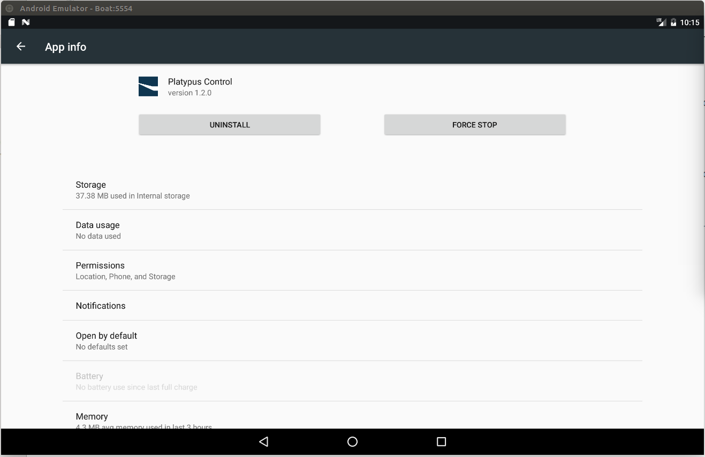
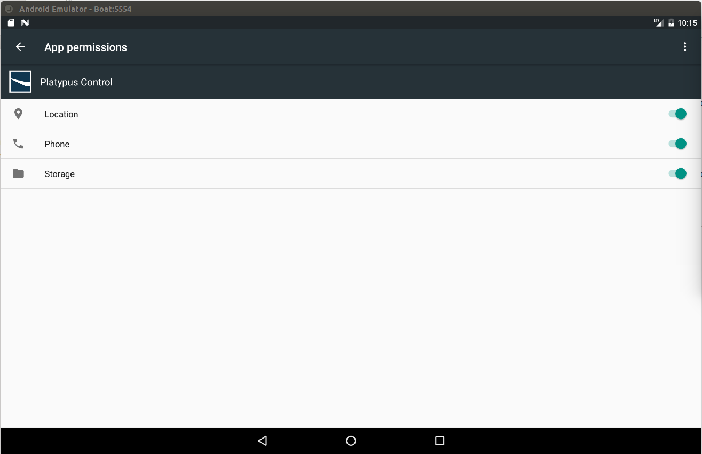
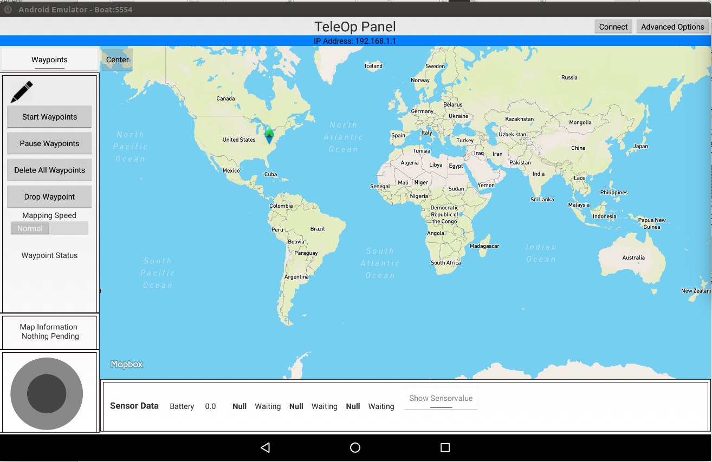

================
Tablet Emulator
================

Some Platypus LLC boats are configured to work with two cellphones: one to control the path of the boat and the other to receive the information of the path and transmit to the eboard. Here we change the cellphone that send controls to the boat by an emulator, and thus, we need only the cellphone to receive the commands and control the boat. Here, our steps are based on the Android SDK emulator using the version 7.0 (`Android Nougat <https://www.android.com/versions/nougat-7-0/>`_) with Google API Intel Atom CPU/ABI.

Downloading and Installing the Emulator
----------------------------------------

Android SDK emulator can be download directly from Android site using ``wget``. After downloading, extract the content in the folder of your preference and add the paths to the ``tool`` folder in ``.bashrc`` file as: 

.. code-block:: bash

   $ wget http://dl.google.com/android/android-sdk_r20-linux.tgz
   $ tar -zxvf android-sdk_r20-linux.tgz
   $ mv android-sdk-linux /home/
   $ echo "export PATH=$PATH:$HOME/android-sdk-linux/tools" >> .bashrc
   $ source ~/.bashrc

Having the SDK installed, you should update it and download the API 24 corresponding to the Android version 7.0. Although the many options you have to install the API support, you can download only the SDK and the Google API Intel Atom CPU/ABI. In order to download the corresponding SDK you may type:

.. code-block:: bash

   $ android

This command opens a window with options to download. Inicially, the API 24 to Android will not appear in the options, but you can update the current ``Android SDK tools`` and ``Android SDK Platform-Tools`` and restart the application up to appear in the screen the newest versions of the APIs. The resulting screen seems like the picture below:

.. image:: images/android.png
   :align: center
   :width: 500pt

After installing the SDK, you have to create the Android Virtual Device (AVD). You can do that by typing: 

.. code-block:: bash

   $ android avd

And a window to create AVDs appears. On this window, select ``Create...`` and a screen to create an AVD will appear. On this screen, create an AVD name and select ``Nexus 10`` as device, ``Android 7.0 - API Level 24`` as Target, ``Google API Intel Atom`` as CPU/ABI, ``No skin`` in Skin, set a value to SD Card and finally check the ``Use Host GPU`` in emulation options in order to increase the processing speed. Following these steps you have a screen filled as follows:

Clicking in ``OK`` will create a AVD in your hard drive that you can access next time as the picture shows:

If everything goes right, you can select your AVD and ``Start...``. Android emulator will start and finally a screen will appear like:

Installing and Configuring Platypus Control
--------------------------------------------

`Platypus Control <https://github.com/platypusllc/tablet>`_ is the app responsible to send the commands to the boat indicating the paths it should follow, as well as controlling the boat with a joystick. The code of this app can be download and compiled from Github official site using Android SDK, but in order to simplify this process, you can download the apk direclty from our repository using ``wget`` as:

.. code-block:: bash

   $ wget --no-check-certificate --content-disposition https://raw.githubusercontent.com/lsa-pucrs/platypus_doc/master/docs/source/boat/scripts/tablet.apk

Send the apk to the emulator and install it. If it was successful, the app will appear in the list of installed apps as presented in the picture:

In the next step we have to set the permissions to the app work, otherwise you cannot open the app. In order to set the permissions, go to ``Settings`` -> ``Apps`` -> ``Platypus Control``. In ``App Info`` select ``Permissions``. In the permissions window, slide to the right all options ``Location``, ``Phone`` and ``Storage``. The sequence of steps is presented in the pictures:

With all permissions set, you can open the Platypus Control app. If everything is fine, you should see a screen like:

