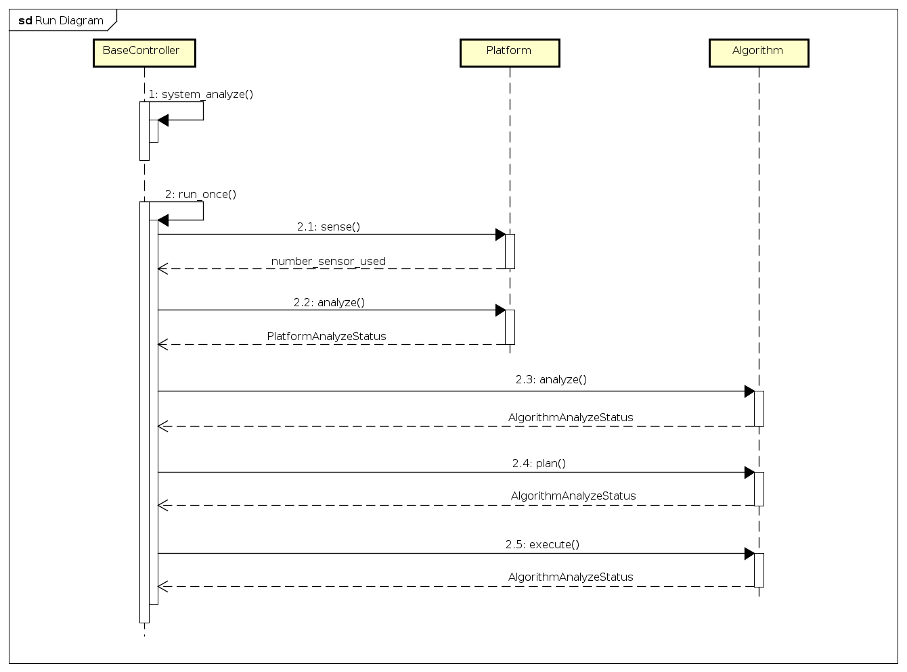
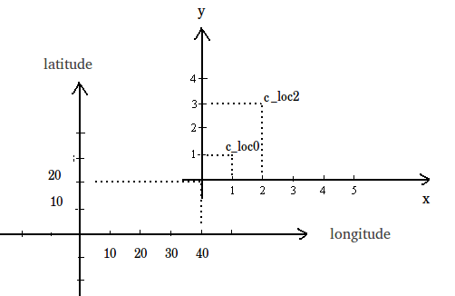

=========================
GAMS/MADARA Background
=========================

In this page, we will provide you a quick start with GAMS/MADARA.

The main loop of GAMS can be resumed with following sequence diagram:

   

where the MAPE process is mapped as:

  * Monitor phase: platform sense;
  * Analyze phase: platform analyze, algorithm analyze;
  * Plan phase: algorithm plan;
  * Execute phase: algorithm execution.
  
The possible values of PlatformAnalyzeStatus are:

   * UNKNOWN = 0,
   * OK  = 1,
   * WAITING = 2,
   * DEADLOCKED = 4,
   * FAILED = 8,
   * MOVING = 16,
   * REDUCED_SENSING_AVAILABLE = 128,
   * REDUCED_MOVEMENT_AVAILABLE = 256,
   * COMMUNICATION_AVAILABLE = 512,
   * SENSORS_AVAILABLE = 1024,
   * MOVEMENT_AVAILABLE = 2048

The possible values of AlgorithmAnalyzeStatus are:

    * UNKNOWN         = 0x00000000,
    * OK              = 0x00000001,
    * WAITING         = 0x00000002,
    * DEADLOCKED      = 0x00000004,
    * FAILED          = 0x00000008,
    * FINISHED        = 0x00000010
    
    
    
There is many algorithms to be used in GAMS/MADARA. 

   * Formation coverage
   * Prioritized Region Coverage
   * Minimum Time Coverage
   * Serpentine Coverage
   * Waypoints
   * Formation Follow
   * Synchronized Formations
   * Convoy Shielding
   * Line Defense
   * Arc Defense
   * Onion Defense
   * Executor

Coordinate systems
------------------

GAMS support two types of coordinate systems: GPS and cartesian. Each coordinate system can have a father, so you can create a tree of coordinate systems. For example, you can specify that you an cartesian coordinate system (named cartesian0) is child of a GPS frame by writing the following code:

.. code-block:: bash

   gams::pose::GPSFrame gps_frame;
   gams::pose::Position gps_loc(gps_frame, 40, 20);
   gams::pose::CartesianFrame cartesian0(gloc);
   gams::pose::position c_loc0(cartesian0, 1, 0);
   
In the code above, to create a cartesian frame (named cartesian0) you have to define a position into the gps_frame. After that, you can create points in the cartesian frame, by informing the frame and location (1,0). They will look like this:

Also you can convert between the coodinate systems. For example, to convert the position (2,0) from cartesian frame (cartesian0) to gps_frame, you should write:

.. code-block:: bash

   gams::pose::Position c_loc2(cartesian0, 2, 0);
   gams::pose::Position gps_loc2 = c_loc2.transform_to(gps_frame);
   
Also, you can calc the distance between two points even if they are in different coordinate file system. The only restrition is their file systems be related.

.. code-block:: bash

   double distance = gps_loc.distance_to(c_loc2);
