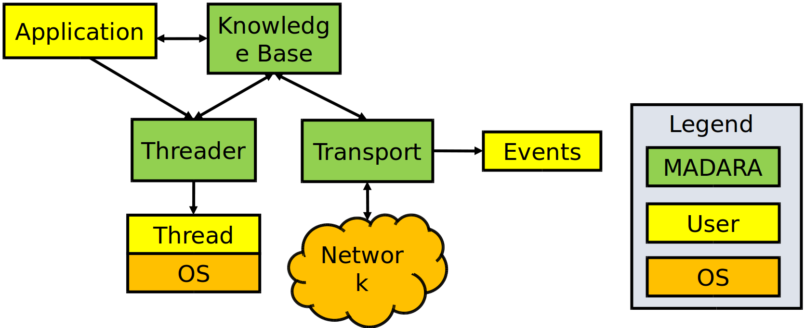
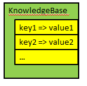

=========================
GAMS/MADARA Background
=========================

In this page, we will provide you a quick start with GAMS/MADARA.

GAMS / MADARA combines the Group Autonomy for Mobile Systems (GAMS) project and the MADARA middleware. MADARA is a communication infrastructure between mobile robots that offers network transport services, threads and automatic sharing of knowledge between agents. The network transport is done via UDP with 3 types of messages: unicast, broadcast and multicast. GAMS provides high-level functionality, such as area coverage planning algorithms, and portable platforms for research in Artificial Intelligence with robotics and multi-agent systems. Researchers can develop algorithms in C ++ and JAVA so that the integration between heterogeneous agents is made easier, since GAMS was created on top of the MADARA project.
The GAMS / Madara integrates the advantages of MADARA, a middleware for distributed systems with the convenience offered by the GAMS to develop algorithms for easy interaction between heterogeneous robots. Figure below shows the block diagram of MADARA. MADARA consists of three components: Knowledge base, threader and transport.

The Knowledge base is essentially the world model generated by each agent. Information about mission, location, orientation, and robot type (real or simulated) are populated on the basis of knowledges. Each agent mounts its base of knowledges according to the environment data obtained by the sensors. The data remains at the base as a mapping of all the stimuli captured by the platform.

The transport block is responsible for transferring knowledges through the agent network, allowing the exchange of information between the \ emph {knowledges} of each agent. Since the threader allows the programmer to create threads similarly to libraries threads, such as threads STL, boost threads, among others. The advantage of the threader is that it comes integrated with Knowledge base, ie each thread contains a reference to Knowledge Base, which is shared, updated by all threads of the agent.

Thus, with the integration of threads, transport services and knowledge services, MADARA stands out by allowing the sharing of data between agents and within the agent itself. The data are distributed transparently to the programmer, ie that sets new values and MADARA responsibility by grouping them in UDP packets and decide the best time to send them over the network, which tends to improve use. In addition, each variable mapped on the basis of Knowledge already offers automatically critical region protection through mutexes hence the user can view and change the values in different threads without worry with racing conditions.

As can be seen in figure below, the variables are mapped to Knowledge Base by a tuple: key and value. Each key must be unique and allows the programmer to identify a value stored in knowledge. The programmer can invoke explicit queries via the functions call, or you can tell that a variable of the type container is related to a specific key of the Knowledge Base. In the last case, whenever the value is updated, the variable will be automatically updated. The shape of the key has meaning and helps to identify if the value is private or, in case of being sent to other agents, it allows identifying who belongs to that value. Private variable keys begin with a dot, whereas a public variable of the number 4 agent must be prefixed with ``agent.4.``.

However, just set a variable is public does not guarantee that it will be delivered to other agents, you must configure the transport module, stating the type of message (unicast, multicast and Broadcast), the IP address and the port of each agent that should receive the information.

Above, you can see GAMS diagram, which is build on top of MADARA middleware. GAMS heritage all characteristics. Algorithms developed by users are executed by ``Controller`` by running MAPE Loop. So, the main loop of GAMS can be resumed with following sequence diagram:

.. image:: images/GamsRunLoop.png
   :align: center
   :width: 500pt
   

where the MAPE process is mapped as:

  * Monitor phase: platform sense;
  * Analyze phase: platform analyze, algorithm analyze;
  * Plan phase: algorithm plan;
  * Execute phase: algorithm execution.
  
The possible values of PlatformAnalyzeStatus are:

   * UNKNOWN = 0,
   * OK  = 1,
   * WAITING = 2,
   * DEADLOCKED = 4,
   * FAILED = 8,
   * MOVING = 16,
   * REDUCED_SENSING_AVAILABLE = 128,
   * REDUCED_MOVEMENT_AVAILABLE = 256,
   * COMMUNICATION_AVAILABLE = 512,
   * SENSORS_AVAILABLE = 1024,
   * MOVEMENT_AVAILABLE = 2048

The possible values of AlgorithmAnalyzeStatus are:

    * UNKNOWN         = 0x00000000,
    * OK              = 0x00000001,
    * WAITING         = 0x00000002,
    * DEADLOCKED      = 0x00000004,
    * FAILED          = 0x00000008,
    * FINISHED        = 0x00000010
    
    
    
There is many algorithms to be used in GAMS/MADARA. 

   * Formation coverage
   * Prioritized Region Coverage
   * Minimum Time Coverage
   * Serpentine Coverage
   * Waypoints
   * Formation Follow
   * Synchronized Formations
   * Convoy Shielding
   * Line Defense
   * Arc Defense
   * Onion Defense
   * Executor

Coordinate systems
------------------

GAMS support two types of coordinate systems: GPS and cartesian. Each coordinate system can have a father, so you can create a tree of coordinate systems. For example, you can specify that you an cartesian coordinate system (named cartesian0) is child of a GPS frame by writing the following code:

.. code-block:: bash

   gams::pose::GPSFrame gps_frame;
   gams::pose::Position gps_loc(gps_frame, 40, 20);
   gams::pose::CartesianFrame cartesian0(gloc);
   gams::pose::position c_loc0(cartesian0, 1, 1);
   
In the code above, to create a cartesian frame (named cartesian0) you have to define a position into the gps_frame. After that, you can create a point in the cartesian frame, by informing location (1,1) in relation to gps_frame. They will look like this:

.. image:: images/coordinateSystem.png
   :align: center
   :width: 500pt

Also you can convert between the coodinate systems. For example, to convert the position (2,0) from cartesian frame (cartesian0) to gps_frame, you should write:

.. code-block:: bash

   gams::pose::Position c_loc2(cartesian0, 2, 3);
   gams::pose::Position gps_loc2 = c_loc2.transform_to(gps_frame);
   
Also, you can calc the distance between two points even if they are in different coordinate file system. The only restrition is their file systems be related.

.. code-block:: bash

   double distance = gps_loc.distance_to(c_loc2);
