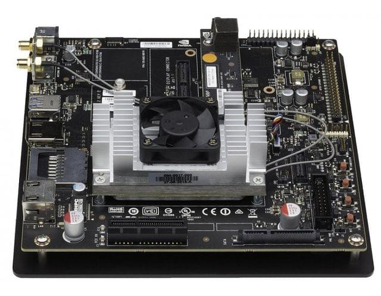

=================
Jetson TX2 Board
=================

NVIDIA Tegra X2 (TX2) is the fastest, most power-efficient embedded AI computing device. This 7.5-watt supercomputer on a module brings true AI computing at the edge. It's built around an NVIDIA Pascal-family GPU and loaded with 8GB of memory and 59.7GB/s of memory bandwidth. It features a variety of standard hardware interfaces that make it easy to integrate it into a wide range of products and form factors. [1]_.

.. toctree::

   Hardware Specification <spec>
   Installing JetPack L4T <os-install>
   Post Installation <../post-install>
   Cloning and Restoring Image <image>
   Installing ROS <ros>
   Configuring Network <peripheral/network>
   Configuring RGBD Camera (ZED) <peripheral/zed>

References
-----------

.. [1] `Jetson TX2 <https://developer.nvidia.com/embedded/buy/jetson-tx2>`_
