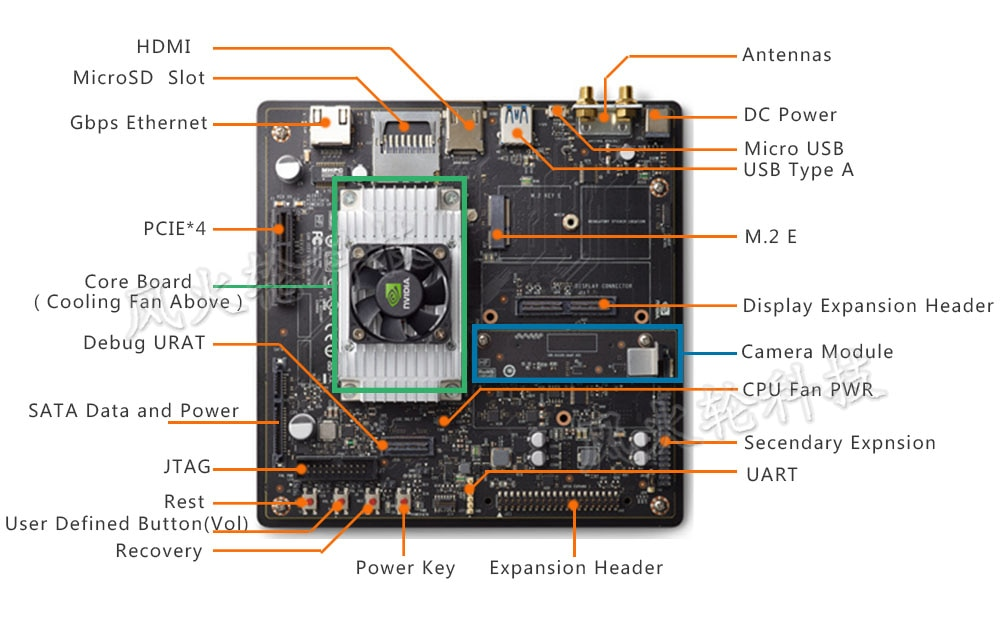

================
Specifications
================

+--------------------------------------------------------+
| - Tegra X2 SOC                                         |
|     - NVIDIA Pascal™, 256 CUDA cores                   |
|     - HMP Dual Denver 2/2 MB L2 + Quad ARM A57/2 MB L2 |
| - 8 GB 128 bit LPDDR4 59.7 GB/s                        |
| - 32 GB eMMC, SDIO, SATA                               |
| - 4K x 2K 60 Hz Encode (HEVC)                          |
| - 4K x 2K 60 Hz Decode (12-Bit Support)                |
| - 2x DSI, 2x DP 1.2 / HDMI 2.0 / eDP 1.4               |
| - 1 USB 2.0 Port, Micro AB                             |
| - 1 USB 3.0 Port, A                                    |
| - 1 Gigabit Ethernet, 802.11ac WLAN, Bluetooth         |
| - 50 mm x 87 mm (400-Pin)                              |
+--------------------------------------------------------+

The following signals are available through an expansion port:

- SPI
- GPIOs
- UART
- i2c
- i2s

