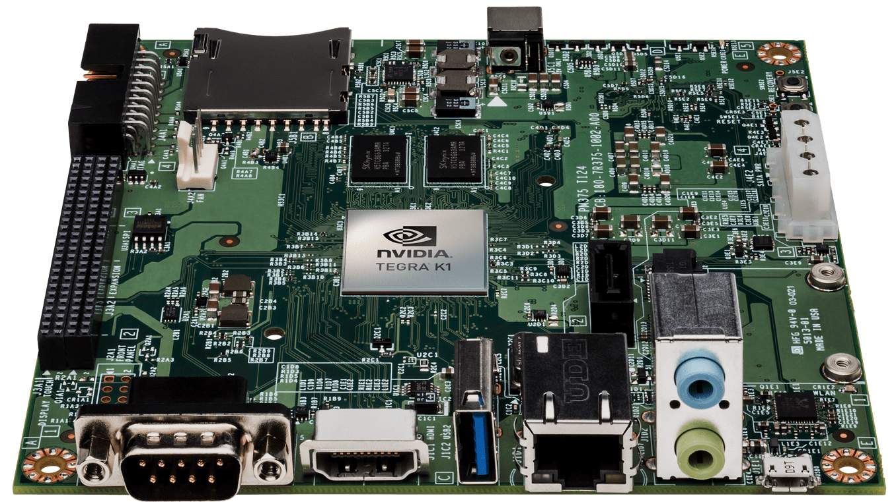

=================
Jetson TK1 Board
=================

NVIDIA Tegra K1 (TK1) is NVIDIA's first mobile processor to have the same advanced features & architecture as a modern desktop GPU while still using the low power draw of a mobile chip. Therefore Tegra K1 allows embedded devices to use the exact same CUDA code that would also run on a desktop GPU (used by over 100,000 developers), with similar levels of GPU-accelerated performance as a desktop [1]_.

Specifications
--------------

+-------------------------------------------------------+
| - Tegra K1 SOC                                        |
|     - NVIDIA Kepler GPU with 192 CUDA Cores           |
|     - NVIDIA 4-Plus-1™ Quad-Core ARM® Cortex™-A15 CPU |
| - 2 GB x16 Memory with 64-bit Width                   |
| - 16 GB 4.51 eMMC Memory                              |
| - 1 Half Mini-PCIE Slot                               |
| - 1 Full-Size SD/MMC Connector                        |
| - 1 Full-Size HDMI Port                               |
| - 1 USB 2.0 Port, Micro AB                            |
| - 1 USB 3.0 Port, A                                   |
| - 1 RS232 Serial Port                                 |
| - 1 ALC5639 Realtek Audio Codec with Mic              |
| - In and Line Out                                     |
| - 1 RTL8111GS Realtek GigE LAN                        |
| - 1 SATA Data Port                                    |
| - SPI 4 MByte Boot Flash                              |
+-------------------------------------------------------+

.. image:: images/jetson_board.jpg
   :align: center
   :width: 500pt

The following signals are available through an expansion port:

- DP/LVDS
- Touch SPI 1x4 + 1x1 CSI-2
- GPIOs
- UART
- HSIC
- i2c

Summary
--------

.. toctree::

   Installing JetPack L4T <os-install>
   Setting Up the OS <setup-os>
   Installing ROS <ros>
   Peripheral <peripheral/index>

References
-----------

.. [1] `Jetson Wiki <https://elinux.org/Jetson_TK1>`_
