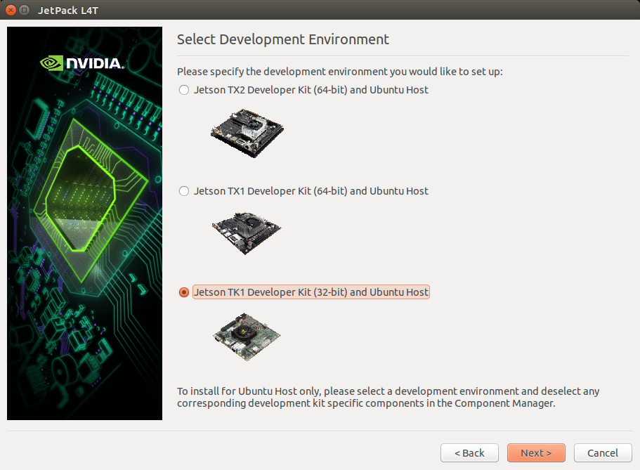
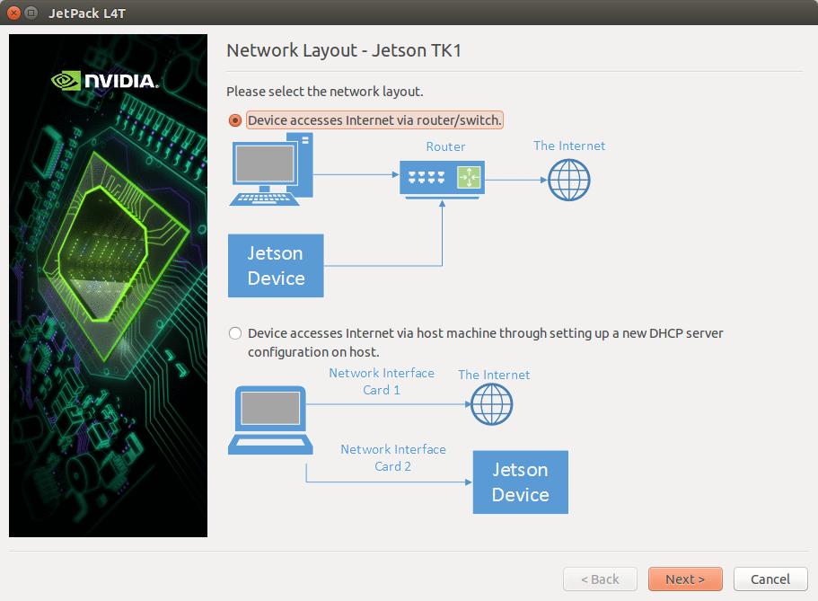
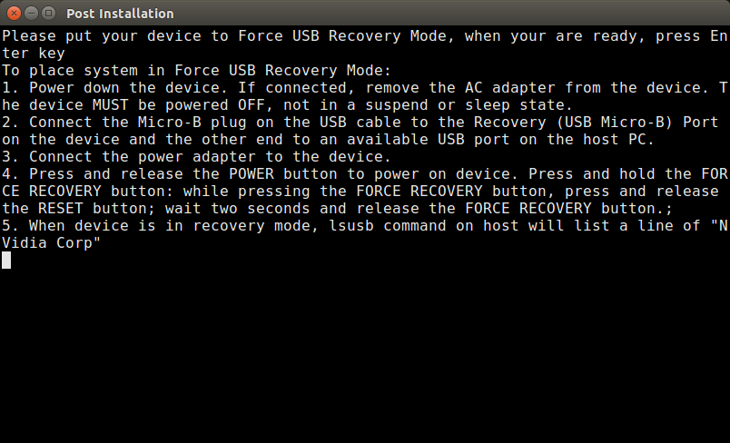

=======================
Installing JetPack L4T
=======================

JetPack (the Jetson SDK) is an on-demand all-in-one package that bundles and installs all software tools required to develop for the NVIDIA® Jetson Embedded Platform (including flashing the Jetson Developer Kit with the latest OS images). JetPack includes host and target developer tools, APIs and packages (OS images, tools, APIs, middleware, samples, documentation including compiling samples) to enable developers to jump-start their development environment for developing with the Jetson Embedded Platform. The latest release of JetPack runs on an Ubuntu 14.04 Linux 64-bit host system and supports the Jetson TK1 Developer Kit [1]_.

Setting up the local host
--------------------------

In order to flash the Jetson board with the SDK, the first step consists of installing Jetpack in a local machine. The local machine can set up all the environment before flashing the board with the SDK. From an Ubuntu 14.04 PC 64 bit host computer, you simply download the `JetPack LT4 3.0 <https://developer.nvidia.com/embedded/jetpack>`_ installer with the latest OS image from NVIDIA Web site (you'll have to sign in with your developer account) and follow the instructions in the setup guide. After downloading JetPack, install it in your local machine (not in the Jetson board).

.. code-block:: bash

    $ chmod +x JetPack-L4T-3.0-linux-x64.run
    $ ./JetPack-L4T-3.0-linux-x64.run

The process starts asking the folder to install JetPack and the board you are using to install the SDK, as follows the image:

Select **JETSON TK1 Developer Kit (32-bit) and Ubuntu host** option and click ``Next``. Keep configuring according to your needs. After finishing the selections, click ``Next`` to start downloading all packages, as the image:

.. image:: images/jetpack_2.png
   :align: center
   :width: 500pt

After downloading all packages, it starts to installing them in your local machine. It took about 20 minutes in my machine... When the installation in the local host is finished, the following image is presented:

.. image:: images/jetpack_3.png
   :align: center
   :width: 500pt

Next step is to configure how the binaries are transmited to the Jetson board. Thus, JetPack asks what is the layout of the network to transmit the data. Select **Device accesses internet via houter/switch.** and click ``Next``, as the image:

JetPack then asks you to put the Jetson board in the *Recovery Mode*, by powering down the device (in case Jetson is on), connecting the micro-USB cable in the recovery port and in the USB of the local host, pressing and holding the FORCE RECOVERY button while turning the board on, as the image:

In order to check if the Jetson board is set in recovery mode, open the terminal in the local host and type:

.. code-block:: bash

    $ lsusb

If the board is in revery mode, you should see the Jetson listed as Nvidia in the output, as the image:

.. image:: images/jetpack_6.png
   :align: center
   :width: 500pt

If you don't see the Jetson using ``lsusb``, then the device will not be flashed. In case the Jetson appears in ``lsusb``, return to the screen with the instructions and press ``Enter`` to start flashing the OS image in the board.

References
-----------

.. [1] `JetPack release notes <https://developer.nvidia.com/embedded/jetpack-3_0>`_
