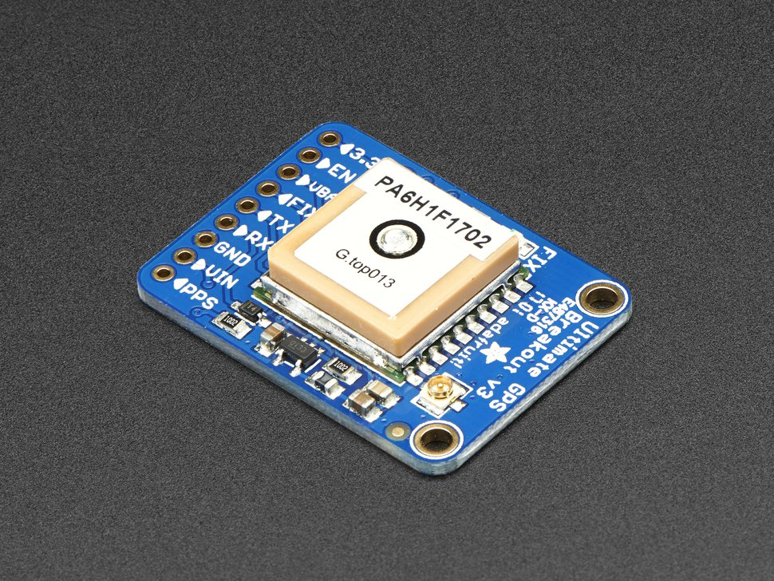

==================================
Installing Adafruit GPS in Jetson
==================================

The `Adafruit GPS <https://www.adafruit.com/product/746>`_ is built around the MTK3339 chipset, a no-nonsense, high-quality GPS module that can track up to 22 satellites on 66 channels, has an excellent high-sensitivity receiver (-165 dB tracking), and a built in antenna. It can do up to 10 location updates a second for high speed, high sensitivity logging or tracking. Power usage is incredibly low, only 20 mA during navigation.

The GPS has also extra goodies: a ultra-low dropout 3.3V regulator so you can power it with 3.3-5VDC in, 5V level safe inputs, ENABLE pin so you can turn off the module using any microcontroller pin or switch, a footprint for optional CR1220 coin cell to keep the RTC running and allow warm starts and a tiny bright red LED. The LED blinks at about 1Hz while it's searching for satellites and blinks once every 15 seconds when a fix is found to conserve power. If you want to have an LED on all the time, there is a FIX signal out on a pin so you can put an external LED on.

The MTK3339-based module has an external antenna functionality and a built in data-logging capability. The module has a standard ceramic patch antenna that gives it -165 dB sensitivity, but when you want to have a bigger antenna, you can snap on any 3V active GPS antenna via the uFL connector. The module will automatically detect the active antenna and switch over. 

.. image:: ../images/gps_antenna.jpg
   :align: center
   :width: 500pt

Specifications
---------------

+-----------------------------------------------------------------------+
| - -165 dBm sensitivity, 10 Hz updates, 66 channels                    |
| - RTC battery-compatible                                              |
| - 5V friendly design and only 20mA current draw                       |
| - Built-in datalogging                                                |
| - PPS output on fix                                                   |
| - Internal patch antenna + u.FL connector for external active antenna |
| - Fix status LED                                                      |
+-----------------------------------------------------------------------+

Technical details
------------------

+----------------------------------------------------------------------------------+
| - Satellites: 22 tracking, 66 searching                                          |
| - Patch Antenna Size: 15mm x 15mm x 4mm                                          |
| - Update rate: 1 to 10 Hz                                                        |
| - Position Accuracy: < 3 meters (all GPS technology has about 3m accuracy)       |
| - Velocity Accuracy: 0.1 meters/s                                                |
| - Warm/cold start: 34 seconds                                                    |
| - Acquisition sensitivity: -145 dBm                                              |
| - Tracking sensitivity: -165 dBm                                                 |
| - Maximum Velocity: 515m/s                                                       |
| - Vin range: 3.0-5.5VDC                                                          |
| - MTK3339 Operating current: 25mA tracking, 20 mA current draw during navigation |
| - Output: NMEA 0183, 9600 baud default, 3V logic level out, 5V-safe input        |
| - DGPS/WAAS/EGNOS supported                                                      |
| - FCC E911 compliance and AGPS support                                           |
| - Up to 210 PRN channels                                                         |
| - Jammer detection and reduction                                                 |
| - Multi-path detection and compensation                                          |
+----------------------------------------------------------------------------------+

Installing GPS support in ROS
------------------------------

In order to install Adafruit GPS package in ROS, go to the source folder in catkin workspace and clone `nmea_navsat_driver <http://wiki.ros.org/nmea_navsat_driver>`_ from github. Having cloned `nmea_navsat_driver`, compile the ROS package and it is ready to be launched.

.. code-block:: bash

   $ cd ~/catkin_ws/src/
   $ git clone https://github.com/ros-drivers/nmea_navsat_driver -b indigo-devel
   $ cd ..
   $ catkin_make
   $ catkin_make install
   $ source devel/setup.bash 

Testing ROS Package
-----------------------

To test the ROS package for IMU, you should call the `nmea_serial_driver` from `nmea_navsat_driver` package, as:

.. code-block:: bash

    $ rosrun nmea_navsat_driver nmea_serial_driver _port:=/dev/ttyUSB0 fix:=/gps/fix

Now you can check whether the topic `/gps/fix` exists.

