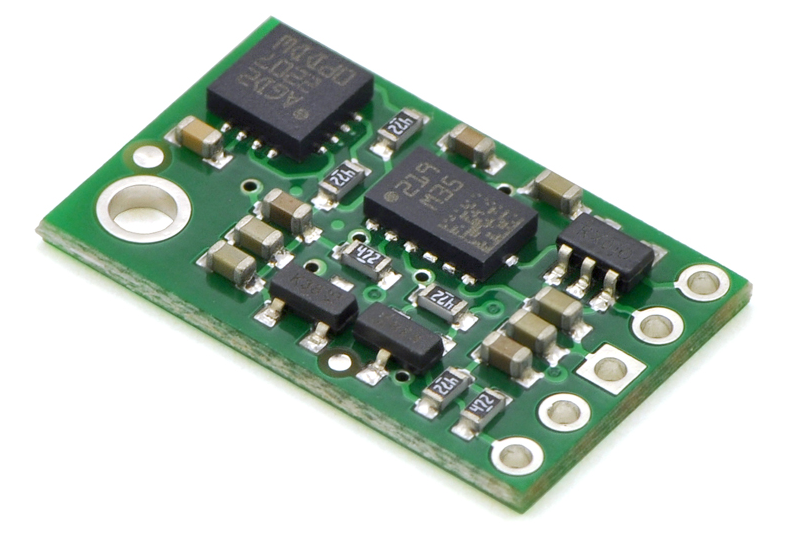
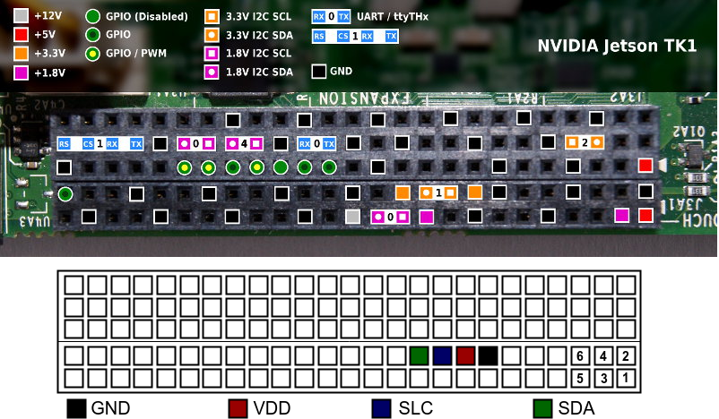

========================
Installing IMU in Jetson
========================

The `Pololu MinIMU-9 v2 <https://www.pololu.com/product/1268>`_ is an inertial measurement unit (IMU) that packs an L3GD20 3-axis gyro and an LSM303DLHC 3-axis accelerometer and 3-axis magnetometer onto a tiny 0.8" × 0.5" board. An I²C interface accesses nine independent rotation, acceleration, and magnetic measurements that can be used to calculate the sensor's absolute orientation. The module includes a voltage regulator and a level-shifting circuit that allows operation from 2.5 to 5.5 V.

The L3GD20 and the LSM303DLHC have many configurable options, including dynamically selectable sensitivities for the gyro, accelerometer, and magnetometer, as well as a choice of output data rates for each sensor. The two ICs can be accessed through a shared I²C/TWI interface, allowing all three sensors to be addressed individually via a single clock line and a single data line. The nine independent rotation, acceleration, and magnetic readings (sometimes called 9DOF) provide all the data needed to make an attitude and heading reference system (AHRS). With an appropriate algorithm, a microcontroller or computer can use the data to calculate the orientation of the MinIMU board; the gyro can be used to very accurately track rotation on a short timescale, while the accelerometer and compass can help compensate for gyro drift over time by providing an absolute frame of reference. The respective axes of the two chips are aligned on the board to facilitate these sensor fusion calculations. 

Specifications
---------------

+---------------------------------------------------------------------+
| - Dimensions: 0.8" × 0.5" × 0.1" (20 × 13 × 3 mm)                   |
| - Weight without header pins: 0.7 g (0.02 oz)                       |
| - Operating voltage: 2.5 to 5.5 V                                   |
| - Supply current: 10 mA                                             |
| - Output format (I²C):                                              |
|   - Gyro: one 16-bit reading per axis                               |
|   - Accelerometer: one 12-bit reading (left-justified) per axis     |
|   - Magnetometer: one 12-bit reading (right-justified) per axis     |
| - Sensitivity range (configurable):                                 |
|   - Gyro: ±250, ±500, or ±2000°/s                                   |
|   - Accelerometer: ±2, ±4, ±8, or ±16 g                             |
|   - Magnetometer: ±1.3, ±1.9, ±2.5, ±4.0, ±4.7, ±5.6, or ±8.1 gauss |
+---------------------------------------------------------------------+

Pinout
-------

+-----+----------------------------------------------------------------------------------------------------------------------------------+
| PIN || Description                                                                                                                     |
+=====+==================================================================================================================================+
| SCL || Level-shifted I²C clock line: HIGH is VIN, LOW is 0 V                                                                           |
+-----+----------------------------------------------------------------------------------------------------------------------------------+
| SDA || Level-shifted I²C data line: HIGH is VIN, LOW is 0 V                                                                            |
+-----+----------------------------------------------------------------------------------------------------------------------------------+
| GND || The ground (0 V) connection for your power supply. Your I²C control source must also share a common ground with this board      |
+-----+----------------------------------------------------------------------------------------------------------------------------------+
| VIN || This is the main 2.5 – 5.5 V power supply connection. The SCL and SDA level shifters pull the I²C bus high bits up to this level|
+-----+----------------------------------------------------------------------------------------------------------------------------------+
| VDD || 3.3 V regulator output or low-voltage logic power supply, depending on VIN.                                                     |
|     || When VIN > 3.3 V, VDD is a regulated 3.3 V output supplying 150 mA to external components.                                      |
|     || Never supply voltage to VDD when VIN is connected, and never supply more than 3.6 V to VDD.                                     |
+-----+----------------------------------------------------------------------------------------------------------------------------------+

Connecting IMU to Jetson
-------------------------

Initially, we have to phisically connect the MinIMU-9 to the Jetson board. We connect the IMU in the Jetson via I²C pins of the board [1]_. As presented in the image below, we use the pins: 14 to GND, 16 to VDD, 18 to SLC and 20 to SDA.

.. image:: ../images/jetson_imu.png
   :align: center
   :width: 500pt

Installing MinIMU-9 v2
----------------------

Once the board is wired up, turn the Jetson TK1 on. After physically connecting the MinIMU-9 to the board, we have to install the MinIMU-9 drivers in the SO to have access to all variables. In order to be able inspect the IMU, you may find it useful to install the i2c tools, by running the command:

.. code-block:: bash

   $ sudo apt-get install libi2c-dev i2c-tools libboost-program-options-dev

To have access to the i2c ports, you have to add the user to ``i2c`` group in Ubuntu. Before adding the user to the group, run ``groups`` command to check whether the user is not already in the group. In case the user is not in ``i2c`` group, run:

.. code-block:: bash

   $ sudo usermod -a -G i2c $(whoami)

Log off and log in again to perform the modification. You may also add the permissions to i2c access by adding the line ``KERNEL=="i2c-[0-7]",MODE="0666"`` to the file ``/etc/udev/rules.d/90-i2c.rules``.

Next step consists of installing the ``minimu9-ahrs`` program that can read data from IMU. In order to install ``minimu9-ahrs`` run:

.. code-block:: bash

   $ git clone https://github.com/DavidEGrayson/minimu9-ahrs.git
   $ cd minimu9-ahrs
   $ make
   $ sudo make install

After compiling and installing ``minimu9-ahrs`` you can run the program by typing:

.. code-block:: bash

    $ ./minimu9-ahrs -b /dev/i2c-1

where ``-b`` selects the i2c port being used. The default I²C bus used by ``minimu9-ahrs`` program is ``/dev/i2c-0``. As we use a different bus, we have to make a configuration file in our home directory named ``.minimu9-ahrs`` with a single line in the form ``i2c-bus=BUSNAME``, where ``BUSNAME`` is the full path to the bus we use. Thus, run:

.. code-block:: bash

    $ echo "i2c-bus=/dev/i2c-1" > ~/.minimu9-ahrs

Calibrating the IMU
--------------------

According to `David Grayson's Github page <https://github.com/DavidEGrayson/minimu9-ahrs>`_ the magnetometer will need to be calibrated to create a mapping from the ellipsoid shape of the raw readings to the unit sphere shape that we want the scaled readings to have. The calibration feature for the *minimu9-ahrs* assumes that the shape of the raw readings will be an ellipsoid that is offset from the origin and stretched along the ``X``, ``Y``, and ``Z`` axes. It cannot handle a rotated ellipsoid. It can be informative to run ``minimu9-ahrs --mode raw > output.tsv`` while moving the magnetometer and then make some scatter plots of the raw magnetometer readings in a spreadsheet program to see what shape the readings have.

To calibrate the magnetometer, run ``minimu9-ahrs-calibrate`` and follow the on-screen instructions when they tell you to start rotating the IMU through as many different orientations as possible. Once the script has collected enough data, it saves the data to ``~/.minimu9-ahrs-cal-data`` and then runs a separate Python script (``minimu9-ahrs-calibrator``) to create a calibration.

The Python script previously had a complicated algorithm powered by SciPy that would take about 20 minutes to run and was not reliable. Currently, the script just uses a very simple algorithm that finds the minimum and maximum values of each axis of the magnetometer and uses those as the calibration values. This is probably not the best way to calibrate your magnetometer; there are more advanced ways that might work better.

The minimu9-ahrs-calibrate script saves the calibration file to ``~/.minimu9-ahrs-cal``. The calibration file is simply a one-line file with 6 numbers separated by spaces: ``minimum x``, ``maximum x``, ``minimum y``, ``maximum y``, ``minimum z``, ``maximum z``. These numbers specify the linear mapping from the raw ellipsoid to the unit sphere.

Checking IMU values
--------------------

As a test, you can look at the raw readings from the sensors on your IMU to make sure it is OK by running:

.. code-block:: bash
   $ minimu9-ahrs --mode raw

The output should look something like this:

.. code-block:: bash

  -1318   -3106   -1801     1896    1219    3679        5      18       3
  -1318   -3106   -1801     1898    1200    3681        0      24      -1
  -1318   -3106   -1801     1899    1200    3688       15      17       2
  -1309   -3105   -1799     1874    1201    3671       17      20      -1
  -1309   -3105   -1799     1898    1214    3663       11      15      -2

References
-----------

.. [1] `Jetson's GPIO <https://elinux.org/Jetson/GPIO>`_ 
