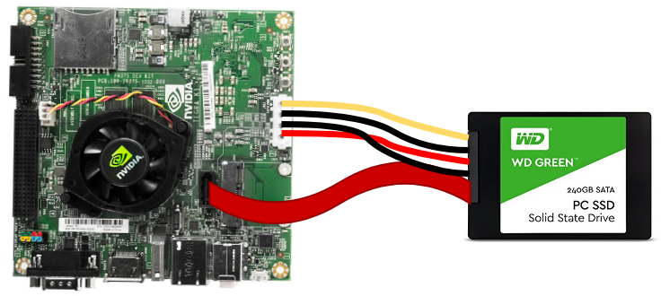
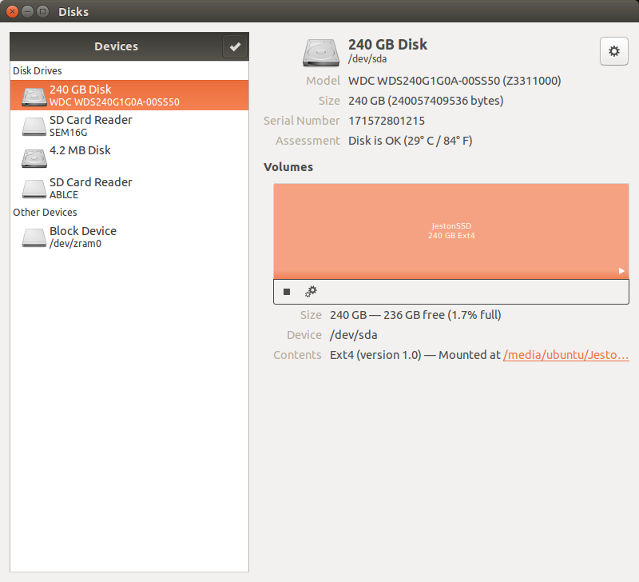
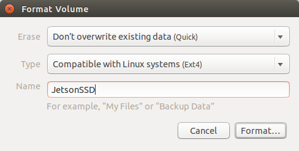

=============================================
Setting Up the OS
=============================================

NVIDIA Jetson TK1 exhibits a lot of promise with lots of raw performance for its form factor and intended use, with low power consumption to boot. But as is typical with most of these types of products, the "out of the box" experience needs some help. A missing part in TK1 is a support out of the box for WiFi or Bluetooth. For people coming from commodity PCs, tablets, phones and such this is a little confusing. Usually one just installs a driver and the device starts to work. In the case of the Jetson, the actual signals on the board need to be played with a little, as well as having the driver issue [1]_. In order to overcome such issues, a new Linux kernel named **Grinch** includes a lot of the features to which most desktop users are accustomed.

Installing Grinch kernel
--------------------------

The Grinch Kernel for L4T provides over 60 changes and additions to the kernel, including fixes, configuration, module and firmware support to the stock kernel. The kernel is written and supported by Jetson Forum user Santyago. For further information about the Grinch Kernel, please see the `NVidia Jetson Forum <https://devtalk.nvidia.com/forums/board/162/>`_.

In order to install the Grinch kernel, download the ``installGrinch.sh`` file and run as:

.. code-block:: bash

    $ wget --no-check-certificate --content-disposition https://raw.githubusercontent.com/lsa-pucrs/platypus_doc/master/docs/source/jetson/scripts/installGrinch.sh
    $ chmod +x installGrinch.sh
    $ ./installGrinch.sh

Running these command will download the kernel image and install it in Jetson board. After the install script completes, reboot the Jetson TK1.

Enabling USB 3.0
-----------------

By default, the USB port in Jetson TK1 is not compatible to 3.0 devices. In order to enable the USB 3.0 support, you have to configure the ``extlinux.conf`` file, changing the parameter ``usb_port_owner_info=0`` to ``usb_port_owner_info=2``. In order to do so, run:

.. code-block:: bash

    $ sudo gedit /boot/extlinux/extlinux.conf

The ``extlinux.conf`` file looks like:

.. code-block:: bash

    TIMEOUT 30
    DEFAULT primary

    MENU TITLE Jetson-TK1 eMMC boot options

    LABEL primary
        MENU LABEL primary kernel
        LINUX /boot/zImage
        FDT /boot/tegra124-jetson_tk1-pm375-000-c00-00.dtb
        APPEND console=ttyS0,115200n8 console=tty1 no_console_suspend=1 lp0_vec=2064@0xf46ff000 mem=2015M@2048M memtype=255 ddr_die=2048M@2048M section=256M pmuboard=0x0177:0x0000:0x02:0x43:0x00 tsec=32M@3913M otf_key=c75e5bb91eb3bd947560357b64422f85 usbcore.old_scheme_first=1 core_edp_mv=1150 core_edp_ma=4000 tegraid=40.1.1.0.0 debug_uartport=lsport,3 power_supply=Adapter audio_codec=rt5640 modem_id=0 android.kerneltype=normal fbcon=map:1 commchip_id=0 usb_port_owner_info=2 lane_owner_info=6 emc_max_dvfs=0 touch_id=0@0 board_info=0x0177:0x0000:0x02:0x43:0x00 net.ifnames=0 root=/dev/mmcblk0p1 rw rootwait tegraboot=sdmmc gpt

Look for ``usb_port_owner_info=0`` in the file and replace it by ``usb_port_owner_info=2``. Finally, save the file and exit.

Adding a SSD Disk
-----------------

In order to add a SSD disk in Jetson board, we have to connect a SATA cable and a power cable in the board as illustrated in the image below:

After connecting the SSD disk, we format it using ``ext4`` file system by logging into Ubuntu and accessing ``Disks`` application. Inside the application, select the SSD disk and click on the gear and select ``Format`` (or press ``Shift+Ctrl+F``). Then, add a name to the disk (e.g. ``JetsonSSD``) and click in ``Format``, as the images below:

After formating the SSD disk, we have to mount it at startup. In order to do it, we create a bash script to mount the disk and move it to ``/etc/init.d`` folder. Our mounting script is based on ``udisksctl`` program and to create it we have the follow steps. With the disk manually mounted, we first run the ``mount`` command to discover where the SSD is mounted, obtaining:

.. code-block:: bash

    $ mount
    /dev/sda on /media/ubuntu/JetsonSSD type ext4 (rw,nosuid,nodev,uhelper=udisk2)

Knowing the mounting local of the SSD disk (``/dev/sda``), we have to discover its uuid. To discover the uuid we run:

.. code-block:: bash

    $ ls -al /dev/disk/by-uuid
    lrwxrwxrwx 1 root root   9 Dec 31 21:00 ac183b24-3e75-4190-bcb7-32160e9a7c55 -> ../../sda

Having the uuid of the disk we can create a script called ``mount_ssd.sh`` with the call to the mounting point. This script contains the following lines:

.. code-block:: bash

    #!/bin/bash
    # Mount the SSD disk at startup

    udisksctl mount --block-device /dev/disk/by-uuid/ac183b24-3e75-4190-bcb7-32160e9a7c55

After creating the script, make the file executable and copy to ``/etc/init.d/`` folder with:

.. code-block:: bash

    $ chmod +x mount_ssd.sh
    $ sudo cp mount_ssd.sh /etc/init.d/

Next, run ``update-rc.d`` to update the scripts by running:

.. code-block:: bash

    $ sudo update-rc.d mount_ssd.sh defaults 99

Next time Ubuntu is started, the SSD disk will be mounted at startup.

Important Packages
-------------------

Here we add several packages that should be installed to work in Jetson. All packages are installed via ``apt-get``. In order to easily install all packages a script was created and can be downloaded by running:

.. code-block:: bash

    $ wget --no-check-certificate --content-disposition https://raw.githubusercontent.com/lsa-pucrs/platypus_doc/master/docs/source/jetson/scripts/additionalPackages.sh
    $ chmod +x additionalPackages.sh
    $ ./additionalPackages.sh

The script installs the following packages:

- `Informational list of build-essential packages (build-essential) <https://packages.ubuntu.com/trusty/build-essential>`_
- `Cross-platform, open-source make system (CMake) <https://packages.ubuntu.com/trusty/cmake>`_
- `Curses based user interface for CMake (cmake-curses-gui) <https://packages.ubuntu.com/trusty/cmake-curses-gui>`_
- `GNU C++ compiler (G++) <https://packages.ubuntu.com/trusty/g++>`_
- `Set of I2C tools for Linux <https://packages.ubuntu.com/trusty/i2c-tools>`_
- `Userspace I2C programming library development files <https://packages.ubuntu.com/trusty/libi2c-dev>`_
- `Distributed revision control system (Git) <https://packages.ubuntu.com/trusty/git>`_
- `Multiple GNOME terminals in one window <https://packages.ubuntu.com/trusty/terminator>`_
- `Terminal multiplexer with VT100/ANSI terminal emulation (Screen) <https://packages.ubuntu.com/trusty/screen>`_

References
-----------

.. [1] `Installing Grinch L4T <http://www.jetsonhacks.com/2014/10/12/installing-grinch-linuxfortegra-l4t-nvidia-jetson-tk1/>`_

