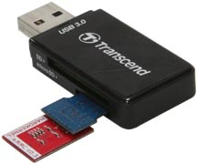

======================
ODROID XU4
======================

.. WARNING::

  @ To be done by Roger and Amory

Download Image 
-----------------------------

Oficial Ubuntu MATE 16.04 for Odroid XU4:

 * https://wiki.odroid.com/odroid-xu4/os_images/linux/start
 * https://odroid.in/ubuntu_16.04lts/

Unzip the Image file and go on to the next part.

Write the Image to the SDCard
-----------------------------

The procedure is the same compared to procedure for Raspberry Pi

 * :ref:`Write the Image using Linux<burn-with-linux>`
 * :ref:`Write the Image using Windows<burn-with-windows>`

Write the Image to the eMMC memory
-----------------------------

One of the nice features of Odroid XU4 is that it has the `eMMC memory module <http://www.hardkernel.com/main/products/prdt_info.php?g_code=G145628174287>`_.
According to them, the eMMC 5.0 storage is ~7x faster than the MicroSD Class-10 card in read tests.
When using it, one can realise that the boot is clearly faster than SD cards.

There are two ways to load eMMC memory, depending whether the eMMC Module Reader is available or not.

Using eMMC Module Reader
~~~~~~~

This method requires the `eMMC Module Reader <http://www.hardkernel.com/main/products/prdt_info.php?g_code=G135415955758>`_

  
Then, the procedure to write the Image is the same for SDCards.
  
Using Odroid and SDCard
~~~~~~~

If the Reader is not available, one can follow these steps:

  * Load the Image on a SDCard as described above
  * Set the memory Switch to select SDCard
  * Plug the eMMC module
  * Turn the system on and boot the system
  * Plug in the USB3 interface a external drive with the Image file
  * Find out the mounting point for the eMMC module, which is most probably ``/dev/mmcblk1``
  * Go to the directory with the Image file and 
  * Execute: ``sudo dcfldd of=/dev/mmcblk1 if=./MyImage.img``

Done, the eMMC module was loaded without using the Reader. 
Now, to test boot with the eMMC, follow these steps:

  * Shutdown the computer
  * Remove the SDCard and make sure the eMMC is connected
  * Set the memory Switch to select eMMC
  * Turn the system on and boot the system

You will see that the time for the boot is shorter and the computer is faster.
It will boot twice when you boot it for the first time. The reason is that it automatically expand the file system in the 1st boot.
However, it is transparant to the user.

Backing up Image from the eMMC memory
-----------------------------

A similar procedure as described in the previous section can be used for backing up the Image in the eMMC module. Follow these steps:

  * Load the Image on a SDCard as described above
  * Set the memory Switch to select SDCard
  * Turn the system on and boot the system
  * Plug in the USB3 interface an external drive where the Image file will be saved
  * Find out the mounting point for the eMMC module, which is most probably ``/dev/mmcblk1``
  * Go to the directory where the Image file will be saved and
  * Execute: ``sudo dcfldd if=/dev/mmcblk1 of=./MyImage.img``

Done! Now it is recommended to :ref:`shrink the Image file <shrinking-image>`.
For more information about loading Image, refer to :ref:`Raspberry Pi 3 procedure<reading-image>`.

Setting Up ROS
-----------------------------

There is no special procedure to install ROS dor Odroid. 
Just follow the same procedure for :doc:`Raspberry Pi 3 </rpi/ros>`, using Ubuntu Mate 16.04.

:doc:`Raspberry Pi 3 1 <rpi/ros>`

:doc:`Raspberry Pi 3 2 </rpi>`

:doc:`Raspberry Pi 3 3 <rpi>`

:doc:`Raspberry Pi 3 4 <source/rpi>`

:doc:`Raspberry Pi 3 5 <source>`

:doc:`Raspberry Pi 3 5 </source>`

Setting Up GAMS/Madara
-----------------------------

There is no special procedure to install GAMS/Madara dor Odroid. 
Just follow the same procedure for :ref:`Raspberry Pi 3 </gams-madara/compilation/index>`., using Ubuntu Mate 16.04.

Setting Up Peripherals
-----------------------------

GPS
~~~~~~~~~~~

describe here how to install `GPS <http://www.hardkernel.com/main/products/prdt_info.php?g_code=G142502154078>`_ drivers.

oCam-1MGN-U Global Shutter
~~~~~~~~~~~

describe here how to install the `oCam-1MGN-U Global Shutter <http://www.hardkernel.com/main/products/prdt_info.php?g_code=G147245683619>`_ camera.

Wifi
~~~~~~~~~~~

The recommended wifi dongle is called `Wifi module 3 <http://www.hardkernel.com/main/products/prdt_info.php?g_code=G137447734369>`_ because it has deattachable antenna

It works out of the box for Ubuntu Mate. No further installation or configuration is required.

USB IO Board
~~~~~~~~~~~

describe here how to install and use the `USB IO Board <http://www.hardkernel.com/main/products/prdt_info.php?g_code=G135390529643>`_.

