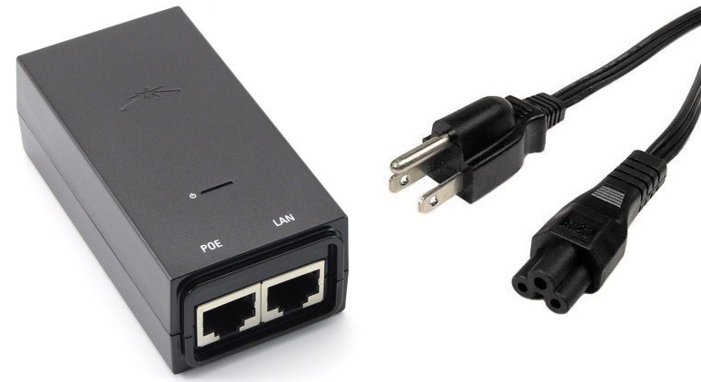
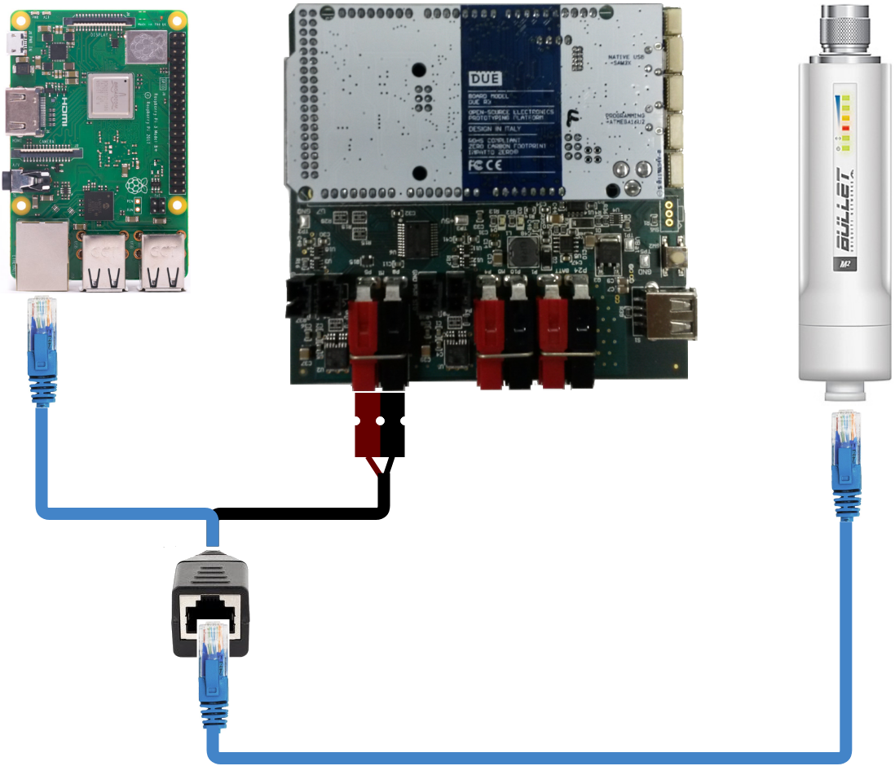
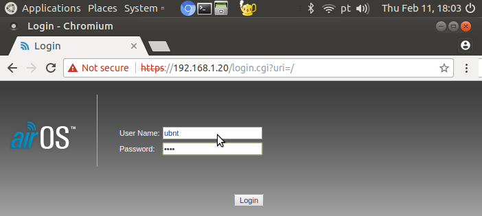
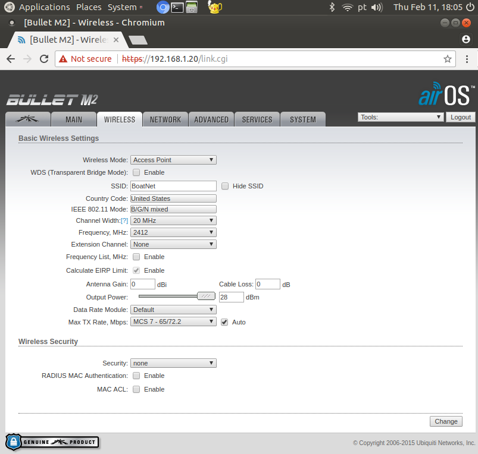
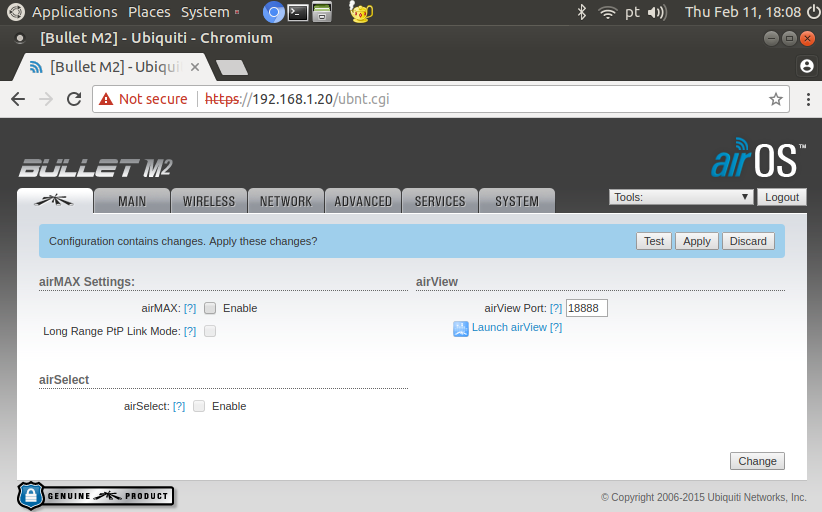
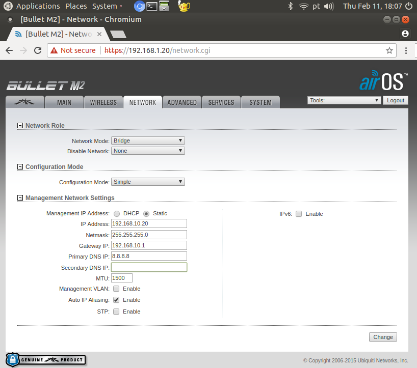

=============================================
Configuring the Ubiquity Bullet M2HP Radio
=============================================

About
------

`Bullet M2HP`_ (Datasheet_) is a high power WiFi radio adapter by Ubiquity.

.. _`Bullet M2HP`: https://www.ubnt.com/airmax/bulletm
.. _`Datasheet`: https://dl.ubnt.com/datasheets/bulletm/bm_ds_web.pdf

.. image:: images/bulletm2.jpg
    :align: center
    :width: 400pt

**Features**:

- 100+ Mbps throughput
- Weatherproof design
- Compatible with high-gain antennas (N-type connector)
- Communication range up to 50 km (depending on the antenna)
- Power-over-Ethernet (PoE)

In the case of the Platypus boat, the Bullet is used as an access point (hotspot), generating a long-range WiFi (WLAN) network for communcation between the boat and the on-shore devices. It connects to the Raspberry Pi via its Ethernet port (LAN).

Powering up the Bullet M2HP
-----------------------------

As the radio is powered through PoE, it comes with a PoE adapter as seen in the image below (exact model may differ):

After plugging the adapter to a power outlet, the PoE port connects to the Bullet, while the LAN port connects to the Raspberry Pi's Ethernet port. In the Platypus boat, the connection is the same, except for the power which comes from the boat's electronics board, as shown in the diagram below:

Accessing the Bullet M2HP configuration page
---------------------------------------------

From a factory reset, the Bullet can be accessed through its standard IP (``192.168.1.20``). However, its default settings are WiFi station and bridge mode. As such, it does not generate a WiFi network nor runs a DHCP server, meaning that a physical cable connection and manual IP setting are necessary. The computer/Raspberry must also be operating in the same IP range as the Bullet, thus it must be a ``192.168.1.x`` IP.

For this initial setup, it is recommended to connect the Bullet to a conventional computer, as the configuration is done via browser (or to a Raspberry running a graphical interface OS). In Linux, we can manually connect to the bullet through the ``ifconfig`` command. After connecting the LAN adapter port into the computer, run:

.. code-block:: bash

    $ sudo ifconfig

to find out which interface is responsible for Ethernet (e.g., ``eth0``, ``enp0s3``). To manually assign an IP and connect, run:

.. code-block:: bash

    $ sudo ifconfig <name_of_interface> 192.168.1.x netmask 255.255.255.0

where ``x`` is a number from 1 to 254, excluding 20. For example:

.. code-block:: bash

    $ sudo ifconfig eth0 192.168.1.7 netmask 255.255.255.0

The Bullet configuration page can the be accessed in a browser by the address ``http://192.168.1.20``. A untrusted connection or security certificate warning may appear, which can be safely ignored. A screen like the one below will appear:

To connect and configure the M2 Bullet, use the credentials:

.. code-block:: bash

    login: ubnt
    password: ubnt

Configuring the Bullet M2HP as an Access Point
-----------------------------------------------

To configure the Bullet as an access point, change the following configurations in the ``Wireless`` tab:

.. code-block:: bash

    Wireless mode: Access Point
    SSID: <WiFi network name>
    Channel Width: 20 MHz
    Frequency, MHz: 2412
    Output power: Max
    Security: None (you may setup WPA-PSK or WPA2-PSK if prefered)

Click "Change" but **do not click "Apply" yet**. In the leftmost tab, uncheck the "AirMax" box and click "Change". 

This is sufficient to configure the radio as an Access Point, and it will generate a WiFi network with the specified SSID. However, there are two possible configurations regarding the Bullet's network role: *Bridge* and *Router* mode. 

.. note:: The typical configuration is to use the Bullet in *Router* mode with a DHCP server, as to automatically address an IP to each connecting device. If this is the case, this configuration can be performed in the "Network" tab and the changes can be applied with the "Apply" button. After a short connection drop, you may connect to the access point's WiFi network and access it with the IP specified in the "Network" tab. As the Router mode isolates the LAN and WLAN interfaces, connection between wireless devices and the Raspberry's Ethernet becomes impossible. Thus, in the case of the Platypus boat, **the radio must be configured in Bridge mode**.

Configuring the Bullet M2HP in Bridge mode
-------------------------------------------

In the ``Network`` tab, modify the following fields to configure the radio in bridge mode:

.. code-block:: bash

    Network mode: Bridge
    Management IP Address: Static
    IP Address: <IPV4 IP> (e.g., 192.168.10.20)
    Netmask: 255.255.255.0
    Gateway IP: <First IP in the same range as IP Address> (e.g., 192.168.10.1)
    Primary DNS: 8.8.8.8

Click ``Change`` and then ``Apply``. After a short connection drop, the radio will generate a WiFi network with the SSID specified in the ``Wireless`` tab.

Testing the connection between WiFi and the Raspberry's Ethernet
-----------------------------------------------------------------

As there is no DHCP server, the Raspberry and WiFi devices must be manually connected to the Bullet. Once again, this can be done with the ``ifconfig`` command in Linux. For the Raspberry, the interface used is the Ethernet (e.g., ``eth0``). After connecting the LAN cable on the Raspberry's Ethernet port, run:

.. code-block:: bash

    $ sudo ifconfig <name of interface> <IP in the same range as the Bullet> netmask 255.255.255.0

For example:

.. code-block:: bash

    $ sudo ifconfig eth0 192.168.10.210 netmask 255.255.255.0

Setting IP by ``ifconfig`` will assign the IP temporarily to the port. In order to fix a static IP to the Raspberry Pi, the ``/etc/dhcpcd.conf`` must be edited, adding the following lines to the end of the file:

.. code-block:: bash

    interface eth0
    static ip_address=192.168.10.210/24
    static routers=192.168.10.1
    static domain_name_servers=192.168.10.1

Configuring Android Devices
----------------------------

An IP must also be manually set for the WiFi devices. In Android 7.0, this can be done as follows:

- Settings -> Connections -> Wi-Fi
- Touch the Bullet's WiFi network
- Check "Show advanced options"
- IP settings -> Static
- IP address -> IP in the same range as the Bullet (e.g., 192.168.10.207)
- Gateway -> Same as specified in the "Network" tab (e.g., 192.168.10.1)
- DNS 1 -> 8.8.8.8

To test the connection, run the "ping" command on the Raspberry:

.. code-block:: bash

    $ ping <IP of connected WiFi device>

or on the WiFi device (if available):

.. code-block:: bash

    $ ping <IP of Raspberry>

If successful, there should be a response such as:

.. code-block:: bash

	PING 192.168.10.207 (192.168.10.207) 56(84) bytes of data.
	64 bytes from 192.168.10.207: icmp_seq=1 ttl=64 time=7.03 ms
	64 bytes from 192.168.10.207: icmp_seq=2 ttl=64 time=17.1 ms
	...
